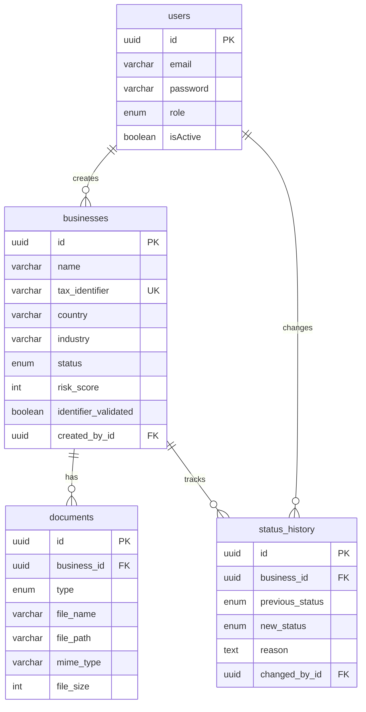

# AGENTS

## Purpose

This repository contains the MVP for an internal company-onboarding portal:

- `frontend/`: Next.js dashboard and auth UI.
- `backend/`: NestJS REST API, JWT auth, business onboarding flows, document uploads, and risk scoring.
- `microservice-format-validation/`: small NestJS service used by the backend to validate fiscal identifier formats.
- `docker-compose.yml`: local orchestration for Postgres plus both services.

## Backend Map

- `backend/src/auth`: JWT login/register/logout and user lookup.
- `backend/src/businesses`: company creation, listing, detail, status transitions, external identifier validation, notifications, and risk score orchestration.
- `backend/src/documents`: document uploads and document listing.
- `backend/src/common`: shared enums, entities, guards, decorators, and small utilities.
- `backend/src/database`: TypeORM datasource, migrations, and seed script.

## Business Flow

1. `POST /api/businesses` validates input, checks duplicate tax ID, asks the format-validation microservice to validate the identifier, creates the business, records the initial status history entry, and refreshes the risk score.
2. `POST /api/businesses/:businessId/documents` stores a document and refreshes risk so missing-document penalties stay current.
3. `PATCH /api/businesses/:id/status` updates status and appends to `status_history` inside a transaction, then emits a structured notification log.

## Data Model

## High-Value Commands

- `cd backend && npm run start:dev`
- `cd backend && npm run migration:run`
- `cd backend && npm run seed`
- `cd backend && npm test`
- `cd backend && npm run lint`
- `docker compose up --build`

## Guardrails

- Prefer adding business logic to dedicated services instead of growing controllers or `BusinessesService`.
- Keep authorization in guards/decorators, not inline role checks.
- Normalize inputs in DTO transforms before they reach services.
- If a change affects onboarding state or documents, make sure risk score recalculation still happens.
