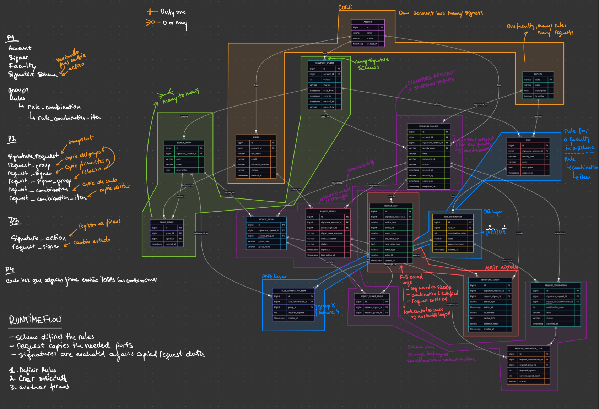
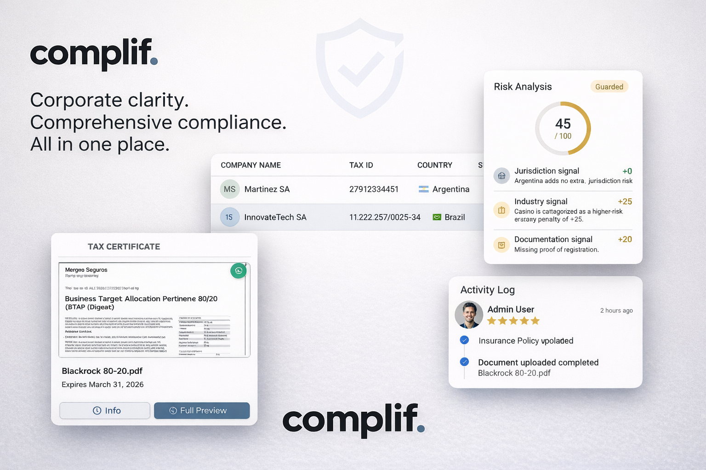
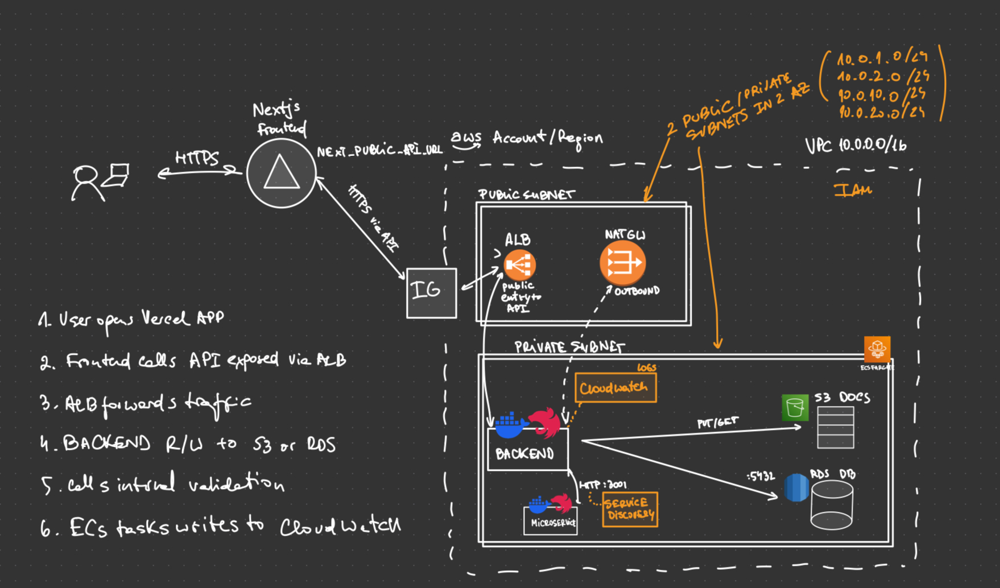
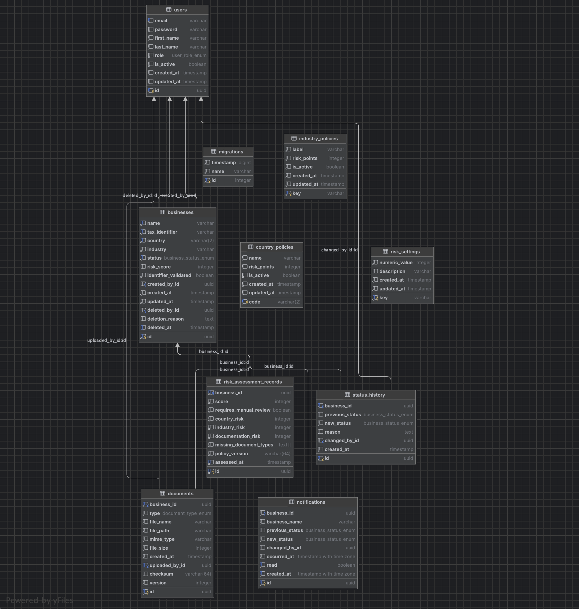

<p align="center">
  
</p>

<p align="center">
  <strong>Complif Software Engineer Technical Challenge</strong><br/>
  Submission covering the data model exercise and the onboarding portal implementation.
</p>

<p align="center">
  
  
  
  
  
</p>

This repository answers both parts of the brief described in
[`docs/software-engineer-technical-challenge.md`](docs/software-engineer-technical-challenge.md).

## Outline

- [Part 1. Data Model for Electronic Signatures](#part-1-data-model-for-electronic-signatures)
- [Part 2. Onboarding Portal Implementation](#part-2-onboarding-portal-implementation)
- [Setup and Local Development](#setup-and-local-development)
- [API Summary](#api-summary)
- [Database and Risk Scoring](#database-and-risk-scoring)
- [Testing and CI](#testing-and-ci)
- [Infrastructure](#infrastructure)

## Part 1. Data Model for Electronic Signatures

The first exercise asks for a model that can represent signature schemas per account, standardized faculties,
signer groups, signature rules, signature requests, valid combinations, and traceability of the signing
process.

This part is documented as a design artifact in the diagrams below.

### Raw Domain Model

<p align="center">
  
</p>

This first diagram keeps the model close to the problem statement and shows the initial entity map before
refinement.

### Refined ER Diagram

<p align="center">
  
</p>

The model is designed to support:

- A reusable catalog of faculties tied to account-level signature schemas.
- Signer groups and rule composition, so one faculty can accept multiple valid signing paths.
- Signature requests that store the required faculty and the combinations evaluated for that request.
- Full auditability of request progress, signer activity, and pending signatures.

## Part 2. Onboarding Portal Implementation

The second exercise is the working platform in this repository. It implements the internal company onboarding
flow with a Next.js frontend, a NestJS backend, a validation microservice, PostgreSQL persistence,
Docker-based local setup, and Terraform for infrastructure definition.

### Application Demo

<p align="center">
  
</p>

### Delivered Scope

- Dashboard with company listing, filters, search, and status visibility.
- Company registration with basic data capture and document upload.
- Company detail with status timeline, document access, and risk assessment visibility.
- JWT authentication with route-level role enforcement for `admin` and `viewer`.
- Deterministic risk scoring based on policy data, country, industry, and document completeness.
- Separate tax identifier validation microservice called by the main backend.
- Real-time notifications, OpenAPI docs, Postman collection, CI validation, and sample seed data.

### Infrastructure Design

<p align="center">
  
</p>

The infrastructure proposal mirrors the local architecture while making the production boundaries explicit.
Vercel hosts the frontend, the backend and validation service run on ECS Fargate, PostgreSQL moves to RDS,
documents are stored in versioned S3, and the network is isolated with public and private subnets plus
security groups. This keeps the deployment simple, auditable, and aligned with the challenge requirements.

### Tech Stack

| Layer                | Technology                                                            |
| -------------------- | --------------------------------------------------------------------- |
| **Frontend**         | Next.js 16, React 19, shadcn/ui, Tailwind CSS 4, Lucide Icons, Sonner |
| **Backend**          | NestJS 11, TypeORM, Passport JWT, Swagger/OpenAPI, nestjs-pino        |
| **Microservice**     | NestJS (country-specific tax ID validator: AR/MX/BR)                  |
| **Database**         | PostgreSQL 16 with TypeORM migrations                                 |
| **Containerization** | Docker, Docker Compose                                                |
| **Infrastructure**   | Terraform (AWS VPC + RDS + ECS + S3 + Vercel)                         |
| **CI/CD**            | GitHub Actions (build, test, deploy validation)                       |
| **Testing**          | Jest, Supertest                                                       |

### Application Architecture

```
┌─────────────┐     ┌──────────────────┐     ┌──────────────────────────┐
│   Frontend   │────▶│   Backend API    │────▶│  Format Validation       │
│  Next.js 16  │     │   NestJS 11      │     │  Microservice (NestJS)   │
│  :3000       │     │   :8080          │     │  :3001 (internal)        │
└─────────────┘     └────────┬─────────┘     └──────────────────────────┘
                             │
                             ▼
                    ┌──────────────────┐
                    │   PostgreSQL 16  │
                    │   :5432          │
                    └──────────────────┘
```

**Key design decisions:**

- **Risk scoring** is a pure deterministic function: same input + same policy = same score, always. Policy
  lives in database tables, not code constants.
- **Status transitions** are constrained (`pending -> in_review -> approved/rejected`) with mandatory reason
  on every change.
- **Document uploads** produce SHA-256 checksums and auto-increment versions per `(business, document_type)`.
- **Every risk assessment** is snapshotted with its full breakdown and a policy version hash for auditability.
- **SSE (Server-Sent Events)** push real-time notifications to the frontend when status changes.
- **Rate limiting** is enabled globally (100 requests/minute per client).
- **Structured logging** via Pino with pretty-print in development.

## Setup and Local Development

### Prerequisites

- [Docker](https://docs.docker.com/get-docker/) and [Docker Compose](https://docs.docker.com/compose/install/)
  (v2+)
- **Or** for local development: Node.js 20+ and PostgreSQL 16+

### Quick Start (Docker)

#### 1. Clone the repository

```bash
git clone https://github.com/cijjas/compliance
cd compliance
```

#### 2. Create environment file

```bash
cp .env.example .env
```

The defaults work out of the box. For production, change `JWT_SECRET`.

#### 3. Build and start all services

```bash
docker compose up --build
```

This starts 4 services:

- **postgres**: PostgreSQL 16 database with health checks
- **format-validation**: Tax ID validation microservice, internal only and not exposed to the host
- **backend**: NestJS API with auto-running migrations
- **frontend**: Next.js application

#### 4. Seed the database

Once all services are running (wait for the backend to log `Nest application successfully started`):

```bash
docker compose exec backend npm run seed:prod
```

This creates:

- 2 users (admin + viewer)
- 25 sample companies across different countries, industries, and statuses
- Documents, status history, and risk assessments for each company

#### 5. Open the application

| Service          | URL                                                              |
| ---------------- | ---------------------------------------------------------------- |
| **Frontend**     | [http://localhost:3000](http://localhost:3000)                   |
| **Backend API**  | [http://localhost:8080/api](http://localhost:8080/api)           |
| **Swagger Docs** | [http://localhost:8080/api/docs](http://localhost:8080/api/docs) |

#### 6. Log in

| Email                | Password    | Role   | Permissions                                                      |
| -------------------- | ----------- | ------ | ---------------------------------------------------------------- |
| `admin@complif.com`  | `admin123`  | Admin  | Full access: create companies, change statuses, upload documents |
| `viewer@complif.com` | `viewer123` | Viewer | Read-only: view companies, documents, and risk scores            |

#### Stopping the services

```bash
docker compose down
```

To also remove the database volume (full reset):

```bash
docker compose down -v
```

### Local Development (without Docker)

#### 1. Start PostgreSQL and create the database

```bash
createdb complif
```

#### 2. Start the format-validation microservice

```bash
cd microservice-format-validation
cp .env.example .env
npm install
npm run start:dev          # runs on :3001
```

#### 3. Start the backend

```bash
cd backend
cp .env.example .env
npm install
npm run migration:run      # apply all migrations
npm run seed               # seed sample data
npm run start:dev          # runs on :8080
```

#### 4. Start the frontend

```bash
cd frontend
cp .env.example .env
npm install
npm run dev                # runs on :3000
```

## API Summary

All endpoints are prefixed with `/api`. Full interactive documentation is available at `/api/docs` (Swagger).

### Authentication

| Method | Endpoint             | Description           | Auth   |
| ------ | -------------------- | --------------------- | ------ |
| `POST` | `/api/auth/register` | Register a new user   | No     |
| `POST` | `/api/auth/login`    | Login and receive JWT | No     |
| `POST` | `/api/auth/logout`   | Logout current user   | Bearer |

### Businesses

| Method   | Endpoint                         | Description                            | Auth   |
| -------- | -------------------------------- | -------------------------------------- | ------ |
| `POST`   | `/api/businesses`                | Create a company                       | Admin  |
| `GET`    | `/api/businesses`                | List companies (paginated, filterable) | Bearer |
| `GET`    | `/api/businesses/:id`            | Get company detail with history        | Bearer |
| `PATCH`  | `/api/businesses/:id/status`     | Change company status                  | Admin  |
| `GET`    | `/api/businesses/:id/risk-score` | Get risk assessment                    | Bearer |
| `DELETE` | `/api/businesses/:id`            | Soft-delete a company                  | Admin  |

**Query parameters for listing:** `page`, `limit`, `status`, `country`, `search` (name search).

### Documents

| Method | Endpoint                        | Description                   | Auth   |
| ------ | ------------------------------- | ----------------------------- | ------ |
| `POST` | `/api/businesses/:id/documents` | Upload a document (multipart) | Admin  |
| `GET`  | `/api/businesses/:id/documents` | List documents for a company  | Bearer |

**Document types:** `fiscal_certificate`, `registration_proof`, `insurance_policy`, `other`

### Reference Data

| Method | Endpoint                     | Description               | Auth   |
| ------ | ---------------------------- | ------------------------- | ------ |
| `GET`  | `/api/businesses/countries`  | List supported countries  | Bearer |
| `GET`  | `/api/businesses/industries` | List supported industries | Bearer |

### Notifications

| Method | Endpoint                    | Description                     | Auth   |
| ------ | --------------------------- | ------------------------------- | ------ |
| `GET`  | `/api/notifications/stream` | SSE stream for real-time events | Bearer |
| `GET`  | `/api/notifications`        | List past notifications         | Bearer |

## Database and Risk Scoring

### Database Schema

<p align="center">
  
</p>

Migrations are managed by TypeORM and run automatically when the backend starts. See
`backend/src/database/migrations/` for the full migration history.

### Migration Path

- `1711500000000-InitialSchema`: creates the core onboarding model with users, businesses, documents, status
  history, enums, and the indexes needed for listing and filtering.
- `1711600000000-AddComplianceReferenceData`: moves country risk, industry risk, and global thresholds into
  tables so scoring stays deterministic and configurable without code changes.
- `1711700000000-AddBusinessSoftDelete`: adds soft delete fields to preserve auditability and avoid losing
  compliance history.
- `1711800000000-AddDocumentAuditAndRiskSnapshots`: adds upload provenance, checksums, versioning, and
  immutable risk snapshots so both documents and scoring are traceable over time.
- `1711900000000-AddNotifications`: stores status-change notifications so the UI can show real-time updates
  and a persisted event trail.

### Risk Scoring

The risk engine computes a score from 0 to 100 based on three factors:

| Factor                 | Source                    | Example                                |
| ---------------------- | ------------------------- | -------------------------------------- |
| **Country risk**       | `country_policies` table  | Cuba (`CU`): +30, Argentina (`AR`): +0 |
| **Industry risk**      | `industry_policies` table | Casino: +25, Technology: +0            |
| **Documentation risk** | `risk_settings` table     | Any required document missing: +20     |

- **Score > 70** = requires manual review (configurable via `risk_settings`)
- Required documents: fiscal certificate, registration proof, insurance policy
- Every assessment is snapshotted with its full breakdown and policy version hash

The scoring function is pure and deterministic, see `backend/src/risk-scoring/risk-assessment.policy.ts`.

## Testing and CI

### Testing

Unit tests run locally, not inside Docker. The production images only contain compiled output.

```bash
# Backend (73 tests across 11 suites)
cd backend
npm test

# Microservice (4 tests)
cd microservice-format-validation
npm test

# Coverage report
cd backend
npm run test:cov
```

---

### CI/CD Pipeline

GitHub Actions runs on every push and PR to `main` with three sequential stages:

| Stage      | What it does                                                                          |
| ---------- | ------------------------------------------------------------------------------------- |
| **Build**  | Compiles backend, microservice, and frontend in parallel (Node 20)                    |
| **Test**   | Runs unit tests for backend and microservice                                          |
| **Deploy** | Validates Terraform configuration (`terraform validate`, no cloud credentials needed) |

See `.github/workflows/ci.yml`.

## Infrastructure

The `infrastructure/` directory contains validated `.tf` files ready to provision. They are not deployed
automatically and are only validated in CI, which matches the scope requested in the challenge.

The design follows the same separation used in local development:

- The frontend is hosted on Vercel.
- The backend API and the format-validation service run as separate ECS Fargate services.
- PostgreSQL runs in RDS inside private subnets.
- Uploaded documents move from a local Docker volume to an encrypted, versioned S3 bucket.
- Public traffic enters through an ALB, while security groups limit service-to-service access.

| Resource                             | Purpose                         | Docker Compose equivalent       |
| ------------------------------------ | ------------------------------- | ------------------------------- |
| VPC (2 public + 2 private subnets)   | Network isolation               | Docker network                  |
| RDS PostgreSQL 16                    | Managed database                | `postgres` service              |
| S3 bucket (versioned, encrypted)     | Document storage                | `uploads` volume                |
| ECS Fargate (backend + microservice) | Application containers          | `backend` + `format-validation` |
| ALB + HTTPS                          | Load balancer / TLS termination | Port 8080 binding               |
| Vercel                               | Frontend hosting                | `frontend` service              |
| Security Groups                      | Ingress/egress rules            | N/A                             |

---

## Project Structure

```
complif/
├── frontend/                          # Next.js 16 + React 19 + shadcn/ui + Tailwind
│   ├── src/app/                       # App router pages (dashboard, login, companies, etc.)
│   ├── src/components/                # UI components (shadcn + custom)
│   ├── src/lib/                       # API client, types, permissions, reference data
│   └── Dockerfile
│
├── backend/                           # NestJS 11 API
│   ├── src/auth/                      # JWT authentication (register, login, logout)
│   ├── src/businesses/                # Company CRUD, status transitions, tax ID validation
│   ├── src/documents/                 # Document upload with checksums and versioning
│   ├── src/risk-scoring/              # Pure risk engine + policy snapshots
│   ├── src/notifications/             # SSE real-time notifications
│   ├── src/common/                    # Entities, enums, guards, decorators, filters
│   ├── src/database/                  # TypeORM migrations (5) and seeds (25 companies)
│   └── Dockerfile
│
├── microservice-format-validation/    # Tax ID format validator (AR: CUIT, MX: RFC, BR: CNPJ)
│   ├── src/validation/                # Validation logic with country-specific rules
│   └── Dockerfile
│
├── assets/                            # Diagrams used in this README
│   ├── db-schema.png                  # Part 2 database schema
│   ├── demo.png                       # Part 2 application promotional image
│   ├── er-1-pure.png                  # Exercise 1 raw data model
│   ├── er-1.jpg                       # Exercise 1 refined ER diagram
│   └── infrastructure.jpg             # Infrastructure design
│
├── infrastructure/                    # Terraform (AWS + Vercel), validated in CI
│   ├── vpc.tf, rds.tf, ecs.tf        # Network, database, compute
│   ├── s3.tf, security-groups.tf      # Storage, firewall rules
│   └── vercel.tf                      # Frontend hosting
│
├── docs/                              # Challenge brief and brand assets
├── .github/workflows/ci.yml          # GitHub Actions pipeline
├── docker-compose.yml                 # Local development orchestration
├── complif.postman_collection.json    # Postman collection with all endpoints
├── AGENTS.md                          # Architecture guide for AI agents / new developers
├── QUESTIONS.md                       # Assumptions and design decisions (22 entries)
├── .env.example                       # Environment variable template
└── CHECKLIST.md                       # Implementation checklist
```

---

## Environment Variables

### Root `.env` (used by Docker Compose)

| Variable              | Default                        | Description                                |
| --------------------- | ------------------------------ | ------------------------------------------ |
| `DB_USERNAME`         | `postgres`                     | PostgreSQL username                        |
| `DB_PASSWORD`         | `postgres`                     | PostgreSQL password                        |
| `DB_NAME`             | `complif`                      | Database name                              |
| `JWT_SECRET`          | `change-me-to-a-random-secret` | Secret for signing JWT tokens              |
| `FRONTEND_URL`        | `http://localhost:3000`        | CORS origin for the backend                |
| `NEXT_PUBLIC_API_URL` | `http://localhost:8080/api`    | API URL used by the frontend at build time |

Each service also has its own `.env.example`, see `backend/.env.example`, `frontend/.env.example`, and
`microservice-format-validation/.env.example`.

---

## Postman Collection

Import `complif.postman_collection.json` into Postman or Thunder Client. It includes:

- **Auth**: Register, login (auto-captures token), logout
- **Businesses**: Create, list (paginated), detail, update status, risk score, soft delete
- **Documents**: Upload (multipart), list by company
- **Format Validation**: Health check, validate AR/MX/BR tax IDs

The collection uses a `{{token}}` variable that is automatically set when you run the login request.

---

## Assumptions and Decisions

All design decisions where the challenge left room for interpretation are documented in
[`QUESTIONS.md`](QUESTIONS.md) (22 entries), including:

- Risk score weights and policy storage strategy
- Status transition constraints and mandatory reasons
- Tax ID validation failure behavior
- Document audit trail (who uploaded, checksums, versioning)
- Risk assessment snapshots with policy version hashing
- Soft delete over hard delete for compliance auditability
- Microservice network isolation

---

## Agent Navigation

[`AGENTS.md`](AGENTS.md) provides a structured guide to the codebase for AI agents and new developers,
covering module boundaries, compliance patterns, anti-patterns, and the data model.
